# T1A3 - School Management Application

## Installation requirements

### Prerequisites
- Python 3.10 or higher installed 
  (https://installpython3.com/)
- Pyhton3 virtual environment (venv) installed 
  (https://packaging.python.org/en/latest/guides/installing-using-pip-and-virtual-environments/)

### Step by step installation
1. Open the terminal
2. Navigate to the project directory:
```
cd ./src/T1A3-School_manager
```
3. Run the executable
```
./run.sh
```

## GitHub Repository
[Link to my GitHub Repository](https://github.com/danilo90lan/T1A3-School_manager-Terminal_application)

## Introduction
This application is designed to help manage student and teacher records in a school system.  
It provides a range of features to add, display, search, and filter records, making it easy to keep track of important information.   
It is built with Python and uses JSON files to store data, making it simple to update and access records.

## Who Is This App For?
This application is primarily designed for school administrators and other staff involved in the management of student and teacher records.  
With this app is possible to:
- Keep track of what subject each teacher is teaching or what course each student is enrolled to
- Filter and export data
-  Adding, delete and update record using a simple and user-friendly interface
- View all records in alphabetical order for quick reference.

## List of features

### 1. Load Data from JSON file
- Load student and teacher records from a JSON file.
- Initialize ID system to ensure each record has a unique ID.

### 2. Add New Records
- Add new teacher and new student records.
- Ensure each new record is assigned a unique ID.

### 3. Display Records
- Display all teacher and students records in alphabetical order.

### 4. Search Records
- Search for a student or for a techer by ID or name.

### 5. Filter Records
- Filter teachers by subject and students by course

### 6. List Subjects and Courses
- List all subjects taught in the school.
- List all courses available in the school.

### 7. Export Data
- Export lists of filtered teachers or students to a different new JSON file.
- Save new records to the JSON file after adding them and sort them alphabetically.

## Code style guide
This application adheres to the PEP 8 style guide.
- Use 4 spaces per indentation level.
- Limit all lines to a maximum of 79 characters.
- Surround top-level function and class definitions with two blank lines.
- Method definitions inside a class are surrounded by a single blank line.
- Imports are always put at the top of the file, just after any module comments and docstrings, and before module globals and constants.
- Use meaningful variable and function names.
- Include docstrings for all modules, classes, and functions.
- Modules should have short, all-lowercase names.
- Function names should be lowercase, with words separated by underscores as necessary to improve readability, as well as method names
- Constants are usually defined on a module level and written in all capital letters with underscores separating words

###### Source reference
https://peps.python.org/pep-0008/

## Project Structure
The app is organized into two main packages:

### Models
The models package contains the following modules:
- **Person**: This is the base class that defines common attributes for both students and teachers, and includes methods for updating and viewing records.
- **Student**: This class inherits from Person and includes additional attributes specific to students, along with methods to update and view student-specific data.
- **Teacher**: This class inherits from Person and includes additional attributes specific to teachers, along with methods to update and view teacher-specific data.
- **School**: This class provides a set of methods to manage and interact with collections of Student and Teacher objects

### Tools Management
The tools_management package contains the following modules:
- **File_operation**: Functions to read from and write to JSON files.
- **Record_operation**: Functions to convert student and teacher objects to dictionaries, functions to create new instances of students and teachers based on JSON data and functions to display sub-menus for the user, allowing choices to update, delete records, search, and filter.  
These functions link to the **School** class, which contains all the methods for handling these operations.

## Development plan
Using Trello I made a development, I've divided the project into different tasks that helps me to track the implementation plan.
Each task in Trello has details like what needs to be done, who is responsible, and any notes or deadlines. It helps me stay organized, know what's being worked on, and track the progress step by step.

### Setup and initializzation
Organize Directories and Files:

- Create a root directory for my project, T1A3-School_manager.
- Inside this directory, create subdirectories to structure different components:
models/: This directory will contain Python classes (Person, Student, Teacher, School).
tools_management/: This directory will contain modules for file operations, record operations, and user interaction (file_operation.py, record_operation.py, menu.py, etc.).
data/: This directory can be used to store JSON files for storing data.
- Initialize Initialize a Git repository:
- Create a .gitignore file to exclude unnecessary files (like virtual environment files)
- Set Up Virtual Environment 
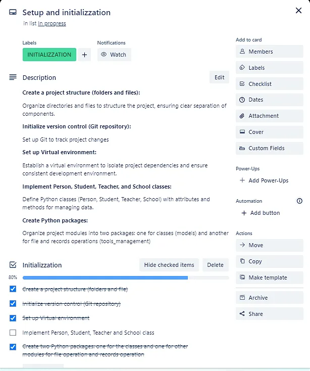

### Defining the features
It's time now to focus on implementing the core features of the school management system.
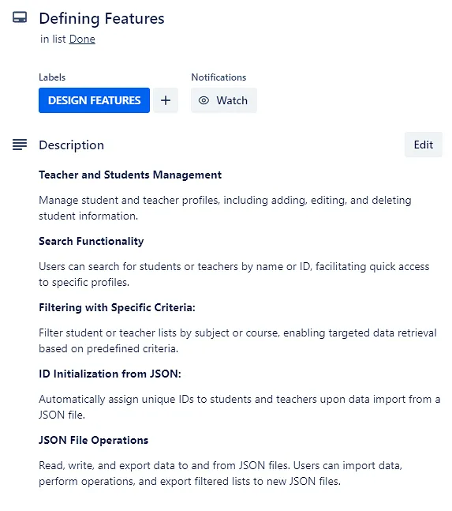

### Implementation of Classes
### 1. Person Class
The Person class serves as the base class for both students and teachers, defining common attributes and behaviors.

#### Class Variables:
- __id: This is a class variable (static variable) prefixed with double underscores (__) to indicate it should not be directly accessed or modified from outside the class. It tracks the unique identifier for each instance of Person.  
__id is private and can only be accessed or modified through defined getter (get_id()) and setter (set_id()) methods.

#### Constructor Method
- Initializes a new instance of Person with attributes name, last_name, and address.
- Uses a class variable __id to assign a unique identifier to each new instance by incrementing it with every instantiation.

#### Class Methods - initialize_id(cls, list_id)
- Purpose: Initializes the class variable __id based on data from a JSON file (list_id). It's not applied at the instance but it's applied at the class itself
- Functionality: If list_id is empty, initializes __id to 0. Otherwise, sets __id to the highest number in list_id. This ensure that each new instance gets a unique ID that continues from the highest ID already in the JSON data. Every time a new object is created, the __id increments by 1, ensuring new instances have unique IDs. 


#### Class Methods - set_id(cls, new_id)
- Purpose: Sets a new value for the class variable __id.
- Functionality: Sets __id to new_id. Ensures new_id is valid and handles potential errors.

#### Class Methods - get_id(cls)
- Purpose: Retrieves the current value of __id.
- Functionality: Returns the current value of __id. Allows external code to access __id indirectly through this method.

#### Static Method - not_empty_value(prompt)
- Purpose: Ensures user inputs are not empty.
- unctionality: Static method used within other methods to prompt users for non-empty inputs repeatedly until a valid input is received.

#### Instance Methods
#### print_info(self)
- Purpose: Generates a formatted string containing details of a Person instance.
- Functionality: Returns a string with ID, name, last_name, and address of the Person instance.

#### update_info(self)
- Purpose: Updates name, last_name, and address attributes of a Person instance.
- Functionality: Uses not_empty_value() static method to prompt users for new values for name, last_name, and address. Handles potential errors gracefully.

### 2. Student Class
The Student class is a subclass of Person and includes additional attributes and methods specific to students.

#### Constructor
The constructor method initializes a new instance of the Student class. It does this by:
- Calling the Parent Constructor: It calls the constructor of the Person class using super(), to initialize inherited attributes (name, last name, address).
- Initializing Student-Specific Attributes: It initializes the student-specific attribute course and sets the profile to "Student".
- Assigning a Unique ID: It assigns a unique ID to the student by calling Person.get_id().

#### Methods - get_id(self)
- Description: This getter method returns the unique ID of the student instance.

#### Methods - print_info(self)
- Description: This method returns a string containing both inherited and student-specific information, such as the course name.

#### Methods - update_student(self)
- Description: This method updates both inherited attributes (name, last name, address) and the course attribute based on user input.

### 3. Teacher Class
The Teacher class is a subclass of Person and includes additional attributes and methods specific to teachers.

#### Constructor
The constructor method initializes a new instance of the Teacher class.
- Calling the Parent Constructor: It calls the constructor of the Person class using super(), to initialize inherited attributes (name, last name, address).
- Initializing Teacher-Specific Attributes: It initializes the teacher-specific attribute subject_area and sets the profile to "Teacher".
- Assigning a Unique ID: It assigns a unique ID to the teacher by calling Person.get_id()

#### Methods - get_id(self)
- Description: This getter method returns the unique ID of the teacher instance.

#### Methods - print_info(self)
- Description: This method returns a string containing both inherited and teacher-specific information, such as the subject area.

#### Methods - update_teacher(self)
- Description: This method updates both inherited attributes (name, last name, address) and the subject_area attribute based on user input.

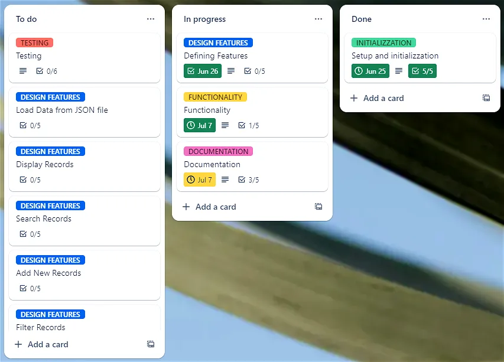

### Read from JSON file
The function read_json() containded in the file_operation module is responsible for reading student and teacher records from a JSON file, creating instances of the Student and Teacher classes, and returning these instances along with their IDs.
- Reading the JSON file and loads the content of the file into the json_data list.
- Processing each record: a for loop iterates over each record in the json data list and collects the ID from eah record and append it to the list_id list.
- Checks if the profile of the record is "Student" or "Teacher"
- Sets the ID for the Person class. This is necessary to retrieve the id for each record in the JSON list.
- Creates an instance of the Student or Teacher (based on the Profile key) class using the values from the JSON record.
- Append the newly created instance to the list where belong (student_list, teacher_list) depending of the profile type

#### Understanding the ID System
**ID Initialization and Incrementation**:

- When a new instance of Person (or its subclasses Student and Teacher) is created, the ID counter is incremented automatically to assign a unique ID to each instance.
- The Person class maintains a class-level ID counter that keeps track of the next available ID.

**Reading Existing IDs**:

- When loading data from the JSON file, each record already has an ID.
- To maintain the continuity of the IDs and ensure no duplicates, the ID counter in the Person class needs to be set to the highest ID value found in the JSON file.

**Setting the ID Counter**:

- The Person.set_id line sets the ID counter to one less than the current record's ID.
- This is done because when a new instance is created, the constructor of the Person class will automatically increment the ID counter by 1.
- By setting the counter to one less than the current record's ID, the next instance created will have the correct ID that matches the one from the JSON data.

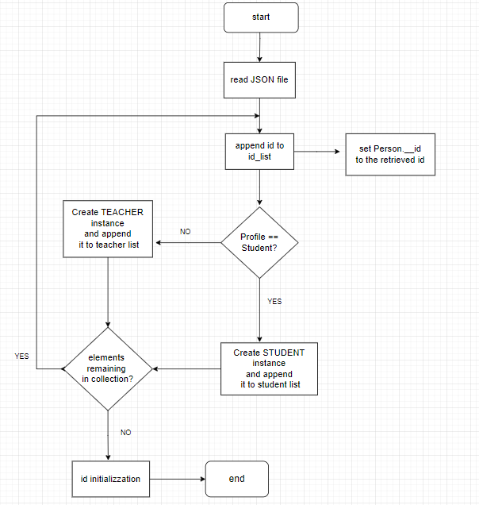
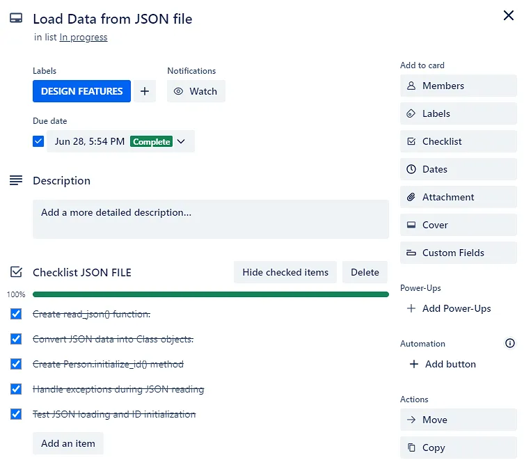

### Write to JSON file
The write_json function is designed to write a list of dictionaries into a JSON file in alphabetical order based on the values of the keys "Name" and "Last name".
The file_path is a constant but has an optional parameter if the user wants to provide a different file path and write to a different file.

**Sorting the Data**:

- The function first sorts the json_data (list of dictionaries) using the sorted() function.
- It uses itemgetter("Name", "Last name") from the operator module as the sorting key. This means it sorts the dictionaries by the value of "Name" first and then by "Last name" if "Name" values are the same.

**Opening and Writing to File**:
- It opens the specified file_path in write mode ("w").
- It uses json.dump() to write the sorted_json_data to the file.
- After successfully writing the JSON data to the file, the function prints a message which is an optional parameter to confirm the operation completed.

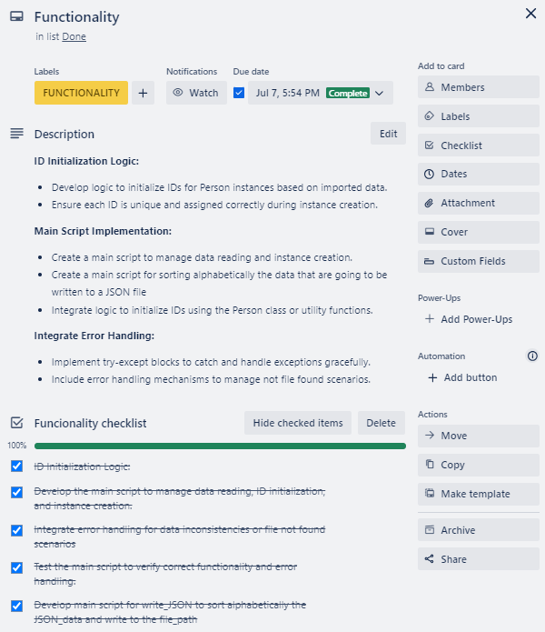
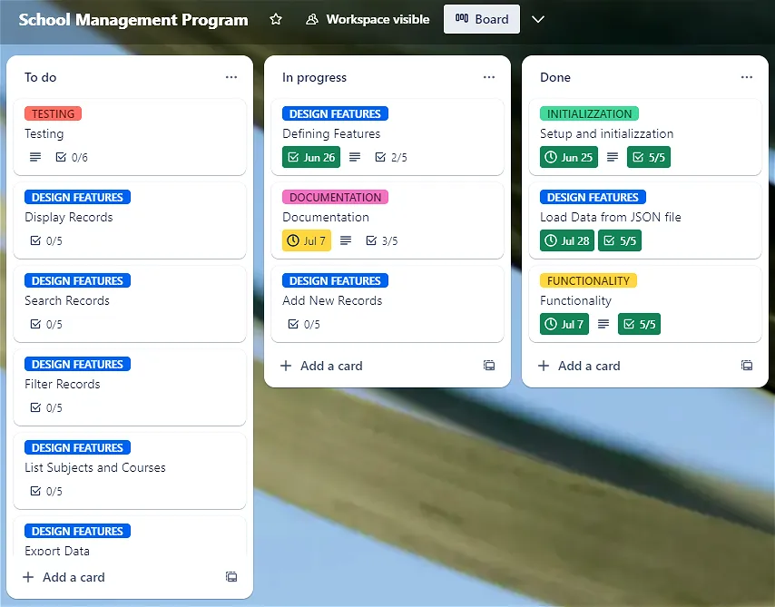

### record_operation module
This module consist of several functions and utility methods designed to manage records of students and teachers in a school system

#### student_new_record() and teacher_new_record():
- These functions prompt the user to enter information like name, last name, address, and either course (for students) or teaching subject (for teachers).
- They create instances of Student or Teacher classes respectively and return the created object (Student or Teacher)

#### student_object_to_dict(students) and teacher_object_to_dict(teachers):
- These functions convert lists of Student or Teacher objects into lists of dictionaries in order to be written to a JSON file
- Each dictionary represents an object's instance with these attributes (#ID, Name, Last name, Address, Course or Subject, Profile).

#### menu_search_student_teacher(school, entity_profile):
- This function displays a menu allowing users to search for either students or teachers by ID or name.
- Based on the entity_profile (either Student.PROFILE or Teacher.PROFILE), it interacts with the school object to perform searches.
- Depending on the search type chosen, it calls appropriate methods (find_student_by_id, find_student_by_name, find_teacher_by_id, find_teacher_by_name)

#### update_delete_records(school, entity_profile, id, operation):
- This function updates or deletes student or teacher records based on the operation parameter (update or delete).
-Depending on the entity_profile (student or teacher), it calls methods on the school object (student_update, delete_student, teacher_update, delete_teacher) to perform the requested operation.

#### menu_update_delete(school, entity_profile, id):
- This function displays a sub-menu allowing users to update or delete a student's or teacher's record.
- Based on the entity_profile and id provided, it interacts with the school object to perform update or delete operations (update_delete_records function).

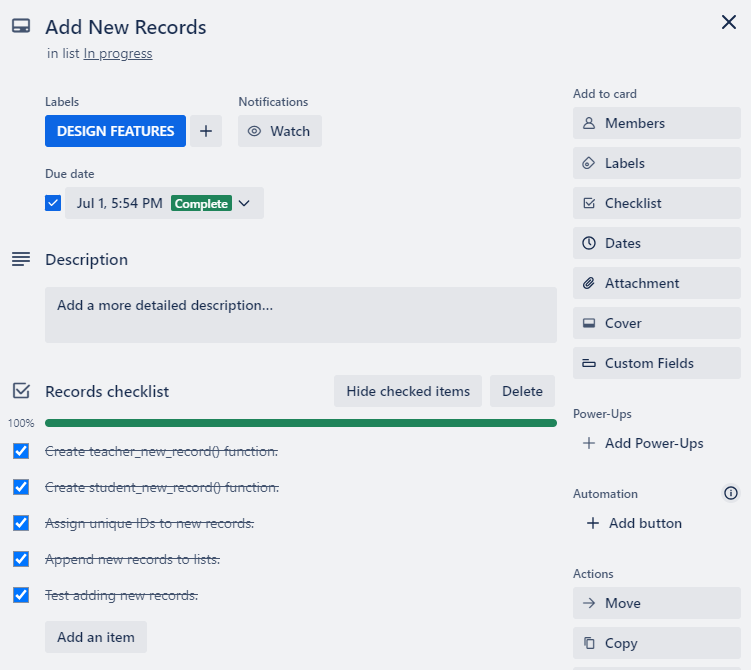
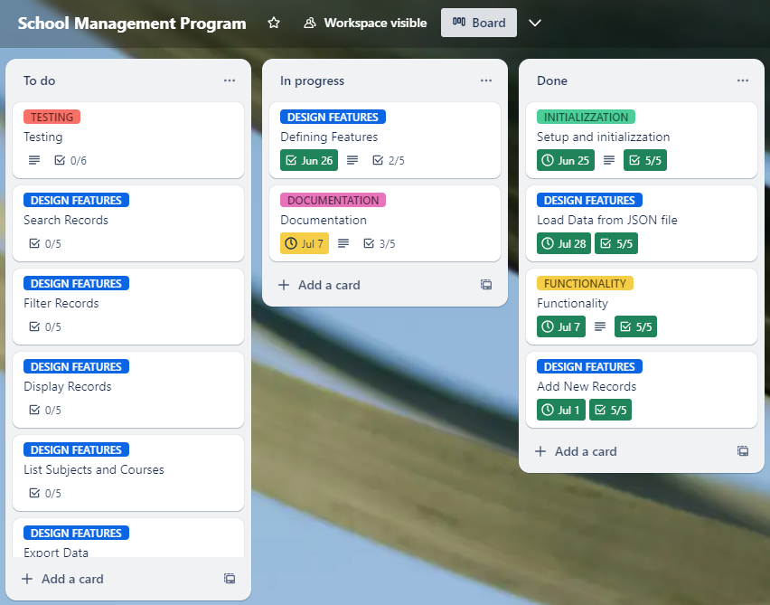

### 3. School Class
This School class manages collections of Student and Teacher objects, providing methods for display, search, update, deletion, and filtering based on course or subject.

#### Constructor
- Initializes the School object with two attributes (a list of students objects and a list of teachers objects).

#### display_all_students()
- Sorts and displays all student objects alphabetically by name and last name, using the sorted() function with a lambda function as the key to sort.
- Prints each student's information using Student.print_info() method.
- Returns the number of students or a message if no students are present

#### find_student_by_id(student_id)
- Searches for a student by its ID
- Iterates through self.students list and compares ID using Student.get_id()
- Prints student information if found, otherwise prints a message.
- Returns True if student is found, False otherwise.

#### find_student_by_name(student_name)
- Finds student by its name.
- Iterates through self.students list and compares name attribute with the given name as parameter
- Prints student information if found and returns True, along with a list of IDs if multiple matches are found. (in case of namesakes)
- It handles scenarios where multiple records might match the search criteria (id could be a single integer or a list of integers) in the case of namesakes. In such cases, it checks the type of id: if it is an integer, it is passed directly to the update_delete function. If it is a list, the function prompts the user to confirm the id due to potential namesakes."
- Returns False if no students are found with the given name.

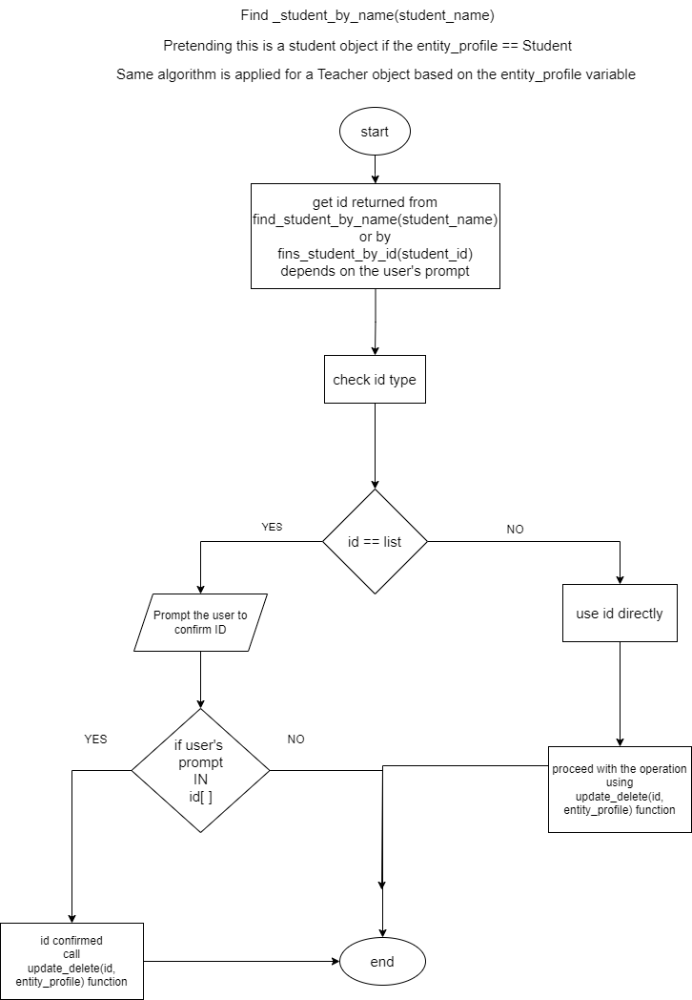

#### student_update(id)
- Updates a student's information based on the given ID
- Calls Student.update_student() method if student ID matches.
- Converts updated data to dictionaries using student_object_to_dict() function
- Writes updated data to JSON file using write_json().

#### delete_student(id)
- Deletes a student's record based on the given ID.
- Removes the student instance from self.students list if ID matches.
- Updates JSON file with the remaining data using write_json().

#### The same functions are built for the Teacher objects, working in the same way but operating on the Teacher instances list instead

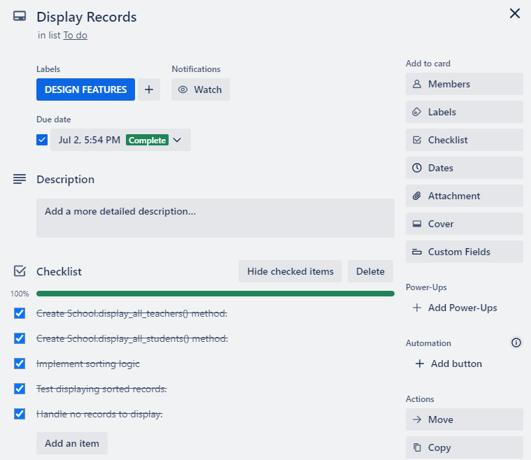

#### filter_students_by_course(course)
- Filters and retrieves students enrolled in a specified course.
- Iterate through the students list and if the student's course attribute is the same to the given course value append it to the matching_student list
- Prints matching student information and returns a list of matching students.

#### filter_teachers_by_subject(subject)
- Filters and retrieves teachers who teach a specified subject.
- Similar to filter_students_by_course, but operates on self.teachers and search for the subject attribute instead

#### print_list_all_courses()
- Prints a list of all unique courses taken by students.
- Uses a set variable to store unique courses.
- Prints each course and returns True if courses are found; otherwise, returns False.

#### print_list_all_subjects()
- Prints a list of all unique subjects taught by teachers.
- Uses a set variable to store unique subjects.
- Prints each subject and returns True if subjects are found; otherwise, returns False.

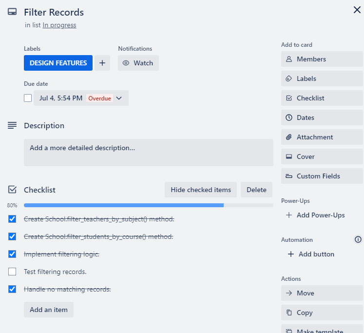

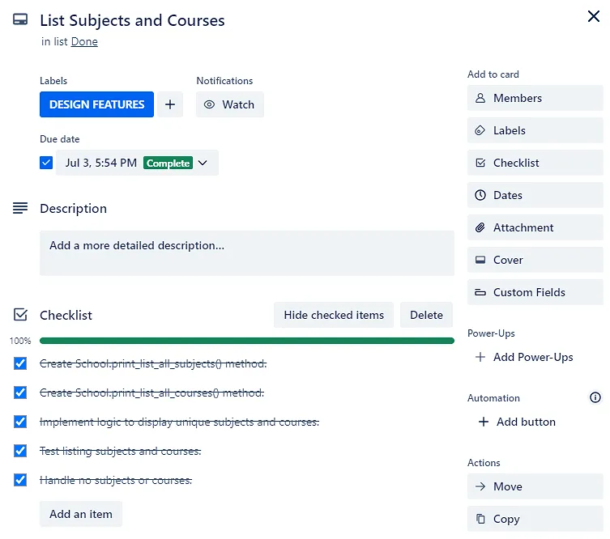
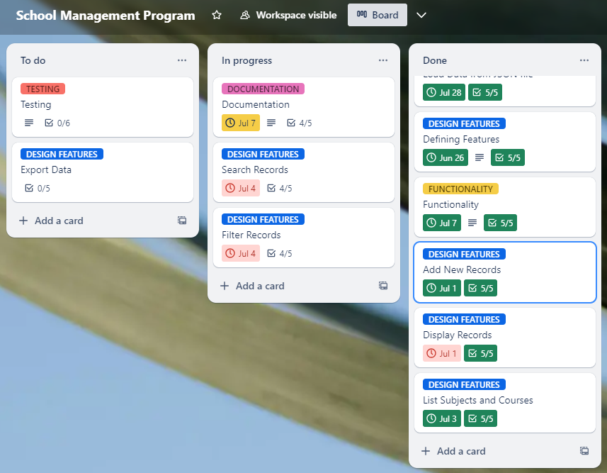

### main() Function
main() is the main hub for managing a school's data (like students and teachers) through interactions with the user.  
It uses principles where School, Person, Teacher, and Student are structured classes that help organize and handle data effectively.
You can add new records, show data, search for specific entries, filter by criteria like subjects or courses, and export data. These tasks are managed through methods within the School class and helper functions (read_json, write_json, etc.).
By separating different tasks into clear functions and classes, the program can grow without becoming confusing. 

#### Initialization:
- Reads data from a JSON file using read_json(), which returns lists of student instances, teacher instances, and a list of IDs.
- Initializes a School object (school) using the lists of student and teacher instances obtained from the JSON file.
- Initializes ID for Person objects using Person.initialize_id(list_id)
- Retrieves the current date and formats it as a string (current_date) using the datetime module imported at the top of the script. The current date is used as part of the file name when exporting lists of students or teachers under a specific subject or course to a JSON file. This helps keep the files organized and makes it easy to know when each file was created.

#### Menu Options:
1. **Enter new teacher:**  
Allows the user to add new teacher records (teacher_new_record()), append them to teachers_instances, and write updated data to a JSON file using write_json().

2. **Enter new student:**  
Allows the user to add new student records (student_new_record()), append them to students_instances, and write updated data to a JSON file using write_json().

3. **Display teachers records (A - Z):**  
Displays all teachers' records sorted alphabetically by calling school.display_all_teachers().

4. **Display students records (A - Z):**
Displays all students' records sorted alphabetically by calling school.display_all_students().

5. **Search student:**
Initiates a search operation for students by ID or name using menu_search_student_teacher(school, Student.PROFILE)

6. **Search teacher:**
Initiates a search operation for teachers by ID or name using menu_search_student_teacher(school, Teacher.PROFILE).

7. **Filter teachers by subject:**
Allows filtering of teachers by subject, prompts for user input to select a subject, filters teachers using school.filter_teachers_by_subject(subject), and optionally exports results to a new JSON file.

8. **Filter students by course:**
Allows filtering of students by course, prompts for user input to select a course, filters students using school.filter_students_by_course(course), and optionally exports results to a new JSON file.

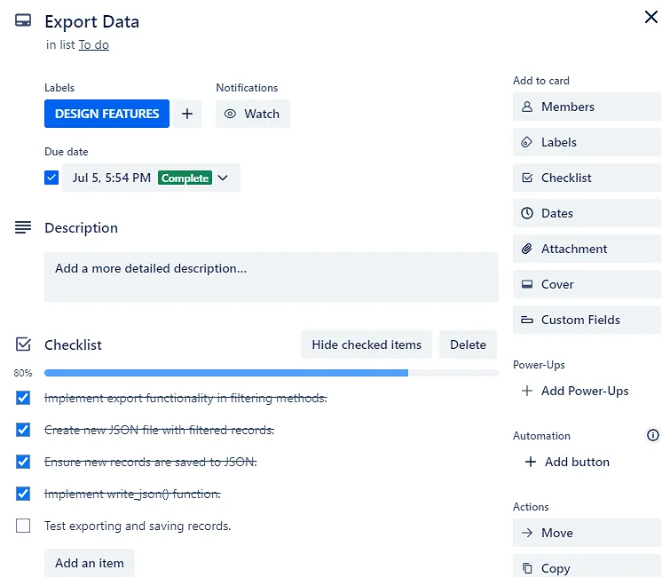

9. **List all subjects:**
Lists all subjects taught in the school by calling school.print_list_all_subjects()

10. **List all courses:**
Lists all courses available in the school by calling school.print_list_all_courses()

11. **Exit program:**

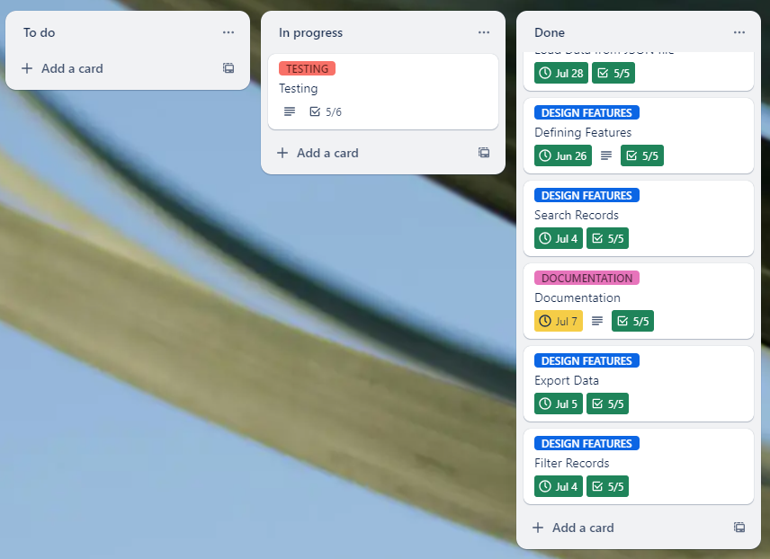

### Testing
The last final step of the development plan is the testing.

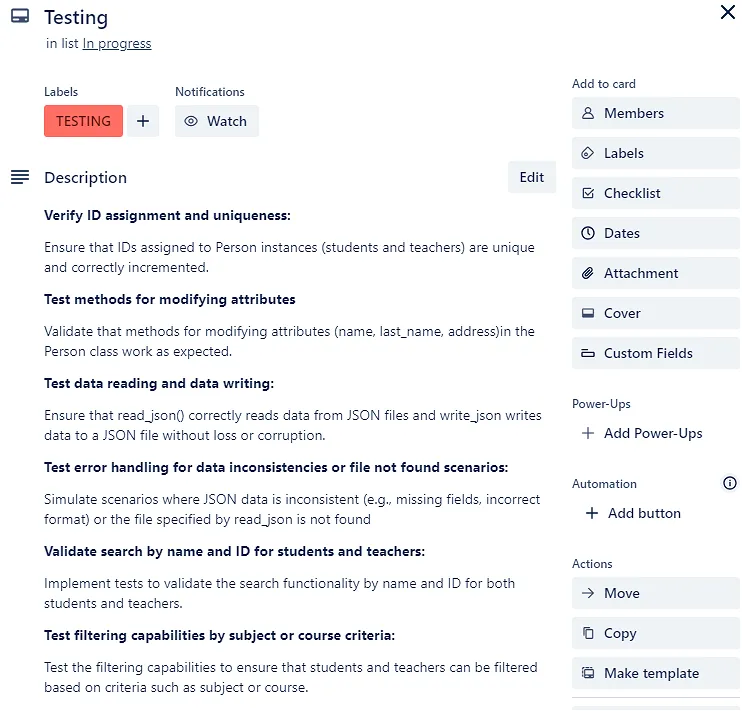


#### Verify ID assignment and uniqueness:
- Creating many Student and Teacher instances.
- Retrieving IDs using get_id() method and verify uniqueness using assertions or print statements.
- Checking that IDs are correctly assigned and incremented without overlaps.

#### Test methods for modifying attributes:
-  Modifying attributes (name, last_name, address) of Person instances and verifying changes.

#### Test data reading and data writing:
- Using sample JSON data containing Student and Teacher records.
- Modifying some records or add new records programmatically.
- Writing modified data using write_json() function and checking if that changes are correctly written in the new JSON file.

#### Test error handling for data inconsistencies or file not found scenarios:
- Introducing errors in the JSON file (like missing fields, incorrect format) or provide a non-existent file path.
- Call read_json() function and handle exceptions (FileNotFoundError, ValueError).
- Ensuring that error messages or exceptions are handled gracefully.

#### Validate search by name and ID for students and teachers:
- Creating instances of Student and Teacher with known attributes.
- Verifying that searches return the correct instances or IDs.

#### Test filtering capabilities by subject or course criteria:
- Creating Student and Teacher instances with various subjects and courses.
- Validating that filtered results match expected criteria and that edge cases (like no matches) are handled correctly.

I will use assert statements with pytest to ensure that the tests validate expected outcomes in an afficient way.